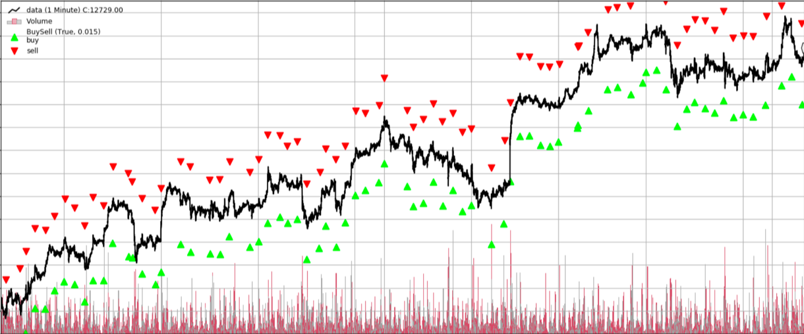
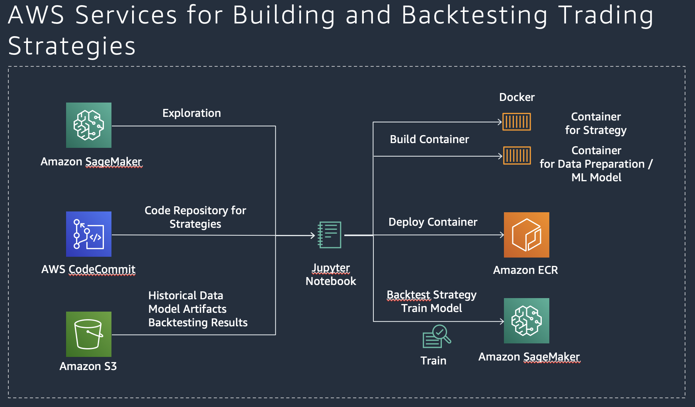
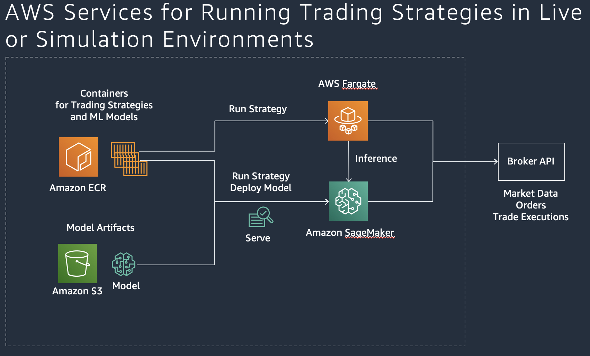

# Algorithmic Trading Workshop

As part of this workshop, participants will learn how to build, backtest, and host algorithmic trading strategies that use technical indicators and advanced machine learning models with Amazon SageMaker.

_Time Commitment Expectations: This workshop was created to be completed in approximately 1 hours._

## Considerations for Each Role
As the team lead on this lean team of one, you'll need to wear multiple hats.  Below are some things we'll cover from the perspective of each role:
* Developer - You'll modify python script to update the trading strategies.
* Data Scientist - You'll need to load the data into your machine learning development environment.  Once loaded, you'll understand the data, use a machine learning algorithm to train the model and do predictions.
* Trader - You will use different trading strategies based on data to maximize Profit & Loss while attributing to Risk.

## Goals

At minimum, at the end of this workshop, you should have backtested several trading strategies using Amazon SageMaker and also trained machine learning models that are used in the trading strategies. You also get a basic understand how trading strategies using trend following and machine learning are developed with Python and can be optimized for better performance.

## Solution Architecture

## Supported regions:
* us-east-1 (N. Virginia)
* us-east-2 (Ohio)
* us-west-2 (Oregon)
* ap-southeast-1 (Singapore)
* ap-northeast-1 (Tokyo)
* eu-central-1 (Frankfurt)
* eu-west-1 (Ireland)

## Step 1: Set up the environment

**Time to complete:** 5-10 minutes.

We are going to use [AWS SageMaker](https://aws.amazon.com/sagemaker/) as our exploration and backtest environment. It will get you bootstrapped with a Jupyter Notebook that is able to run the notebooks for this workshop.

_If you have a running Jupyter Notebook environment, feel free to use that. Make sure you clone this git repository in the notebook and you attach **AmazonEC2ContainerRegistryFullAccess** to the SageMakerExecutionRole that is used in your notebook_

### Step 1.1: Create Git Repository for Notebook Instance

1. Navigate to Amazon SageMaker [in the console](https://console.aws.amazon.com/sagemaker) and Select Notebook / Git Repository and Click **Add repository**.
1. Select GitHub/Other Git-based repo and create a new repository.
1. Set 'Amazon SageMaker repository name' to **algotrading-workshop**, Set 'Git Repository URL' to https://github.com/osteffmann/algotrading-workshop.
1. Select to use No Secret.
1. Click **Add repository**.

### Step 1.2: Create Notebook Instance

1. Navigate to Amazon SageMaker [in the console](https://console.aws.amazon.com/sagemaker) and Select Notebook / Notebooks and Click **Create notebook instance**.
1. Set 'Notebook instance name' to **algotrading**.
1. In the “Permissions and Encryption”section  choose “Enter a custom IAM role ARN” and use the TeamRole ARN provisioned in your account (e.g. “arn:aws:iam:{YourAccountID}:role/TeamRole”)
1. Under Git Repositories, select the default repository from the dropdown list: **algotrading-workshop**.
1. Click **Create notebook instance**.

## Step 2: Prepare market data

**Time to complete:** 2 minutes.

In this module, we prepare stock market data and store per ticker a separate CSV file that contains the daily open, low, high, and close prices and the daily volume.

### Dataset

We use the dataset generated by [Chi Zhang](https://github.com/vermouth1992/drl-portfolio-management/tree/master/src/utils/datasets). It contains the historic price of 16 target stocks from NASDAQ100, including open, close, high and low prices from 2012-08-13 to 2017-08-11. Specifically, those stocks are: “AAPL”, “ATVI”, “CMCSA”, “COST”, “CSX”, “DISH”, “EA”, “EBAY”, “FB”, “GOOGL”, “HAS”, “ILMN”, “INTC”, “MAR”, “REGN” and “SBUX”.
Dataset License

  
<b>This dataset is licensed under a MIT License.</b>

Copyright (c) 2017 Chi Zhang

Permission is hereby granted, free of charge, to any person obtaining a copy of this software and associated documentation files (the "Software"), to deal in the Software without restriction, including without limitation the rights to use, copy, modify, merge, publish, distribute, sublicense, and/or sell copies of the Software, and to permit persons to whom the Software is furnished to do so, subject to the following conditions:

The above copyright notice and this permission notice shall be included in all copies or substantial portions of the Software.

THE SOFTWARE IS PROVIDED "AS IS", WITHOUT WARRANTY OF ANY KIND, EXPRESS OR IMPLIED, INCLUDING BUT NOT LIMITED TO THE WARRANTIES OF MERCHANTABILITY, FITNESS FOR A PARTICULAR PURPOSE AND NONINFRINGEMENT. IN NO EVENT SHALL THE AUTHORS OR COPYRIGHT HOLDERS BE LIABLE FOR ANY CLAIM, DAMAGES OR OTHER LIABILITY, WHETHER IN AN ACTION OF CONTRACT, TORT OR OTHERWISE, ARISING FROM, OUT OF OR IN CONNECTION WITH THE SOFTWARE OR THE USE OR OTHER DEALINGS IN THE SOFTWARE.

### Step 2.1: Run Jupyter Notebook and follow the instructions in the notebook.

Please run the <b>DataPrep</b> Jupyter Notebook in the folder <b>1_Data</b> from your Amazon SageMaker Notebook instance.

## Step 3: Build and backtest trading strategies using Amazon SageMaker

**Time to complete:** 35 minutes.

In this module, we backtest different trading strategies with Amazon SageMaker.

### Step 3.1: Backtest traditional trend following strategy (ca. 15 min)

You can choose between the following Jupyter Notebooks: <b>Strategy SMA</b> or <b>Strategy Breakout</b> in the folder <b>2_Strategies</b> and run it from your Amazon SageMaker Notebook instance. In the instructions of the notebook, there is guidance on how to optimize the strategies.

### Step 3.2: Train machine-learning model for machine-learning based strategy (ca. 10 min)

Select the Jupyter Notebook <b>Train_Model_Forecast</b> in the folder <b>3_Models</b> and run it from your Amazon SageMaker Notebook instance. In the instructions, there is guidance on how to optimize the model.

### Step 3.3: Backtest machine-learning based strategy (ca. 10 min)

Select the Jupyter Notebook <b>Strategy ML Forecast</b> in the folder <b>2_Strategies</b> and run it from your Amazon SageMaker Notebook instance. In the instructions, there is guidance on how to optimize the strategy.

## Step 4: Run and host trading strategies

Available Soon.

### Congratulations! You have completed the workshop. Don't forget to cleanup the resources if you use your own account.

## Step 5: Cleanup (Optional)
To avoid charges for resources you no longer need when you’re done with this workshop, you can delete them or, in the case of your notebook instance, stop them. Here are the resources you should consider:

### Step 5.1: Notebook instances

You have two options if you do not want to keep the notebook instance running. If you would like to save it for later, you can stop rather than deleting it.

1. To stop a notebook instance: click the Notebook instances link in the left pane of the SageMaker console home page. Next, click the Stop link under the ‘Actions’ column to the left of your notebook instance’s name. After the notebook instance is stopped, you can start it again by clicking the Start link. Keep in mind that if you stop rather than delete it, you will be charged for the storage associated with it.
1. To delete a notebook instance: first stop it per the instruction above. Next, click the radio button next to your notebook instance, then select Delete from the Actions drop down menu.

### Step 5.2: S3 Bucket

If you retain the S3 bucket created for this workshop, you will be charged for storage. To avoid these charges if you no longer wish to use the bucket, you may delete it. To delete the bucket, go to the S3 service console, and locate your bucket’s name in the bucket table. Next, click in the bucket table row for your bucket to highlight the table row. At the top of the table, the Delete Bucket button should now be enabled, so click it and then click the Confirm button in the resulting pop-up to complete the deletion.

### Step 5.3: Elastic Container Registry (ECR)

if you retain containers in ECR you created for this workshop, you could be charged for storage. To avoid these charges if you no longer wish to use these containers, you may delete it. To delete containers, go to the ECR service console.
